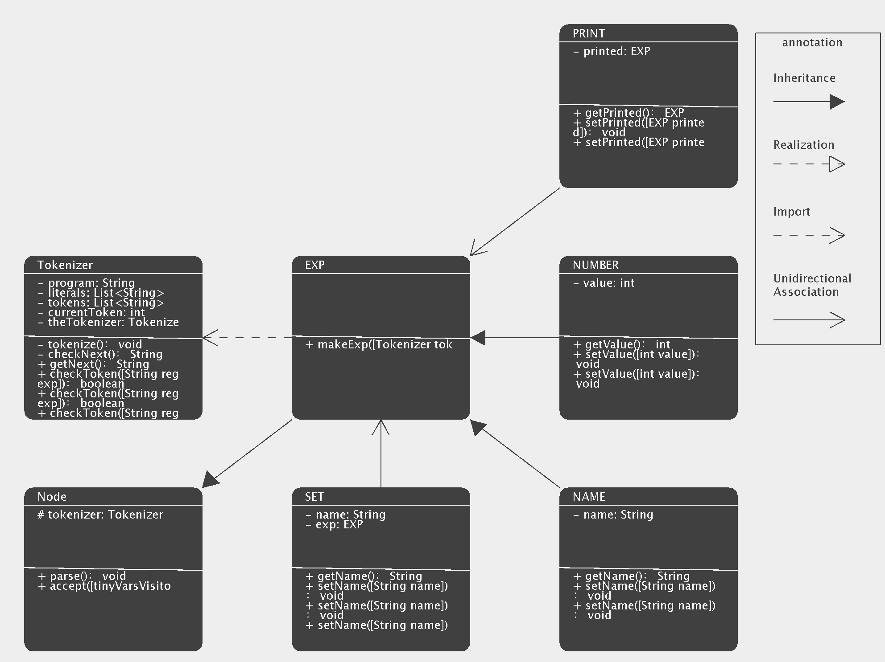

# java-uml-diagram-generator

> Analysis Type: Static Analysis

# Description
Our project can generate a class diagram automatically from a given Java project to illustrate details in classes and the relations among them intuitively.

> INPUT: any folder contains Java code, target class to demostrate its relations (optional)

> OUTPUT: class diagram focusing on a single class

## Motivation
To help programmers who get tired of drawing out the class diagram by hand, or people who want to intuitively and quickly visualize details in classes and the relations among them. 

## Implementation
=> Use a java project as input 
=> Analyse a user-selected class 
=> Collect class information and their relations 
=> use the data and JFrame to generate the corresponding diagrams

## Details
- Class Relation Types
    - (Current) [Association(unidirectional), Inheritance(extends), Realization(implements), Import] 
    - Future Plan: add dependency relation
 
## Constraints
 - currently, this project will only focus on a single target class to illustrate its relations to other classes (up to 9 classes in total).
 - Class fields and methods longer than the given area will be hidden.
 
## Sample outout

---

 # Further Plans
 - support a larger number of Java class in the graph.
      - Challenge: need to figure out how to set the position on the graph to minimize overlapping.
 - support class diagram generation for the whole project, rather than one single class.
      - Challenge: the class dragram may become too messy due to complicate relations among classes.

---

# Team and Work Division

> In alphabetical order of lastname

- Jialin Liu: Java Program analysis
- Feiyi Wang: Visualization
- Marta Yao: Integreation & Visualization
- Jialu Zhang: Visualization
- Pengwei Zhou: Video & User Studies & Testing.

> Thanks everyone for your contribution!
